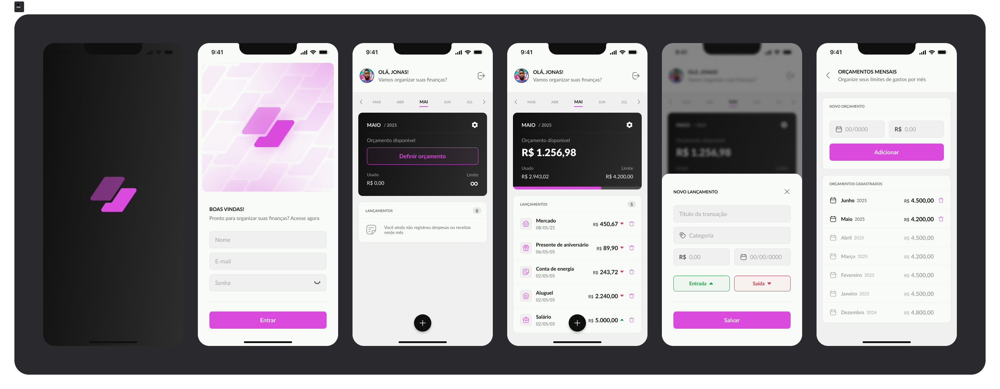

# FinanceApp

Aplicativo iOS de finanças pessoais feito em UIKit, com autenticação via Firebase, cadastro de orçamentos mensais e lançamentos de receitas/despesas.



## Sumário

- [Sobre o projeto](#sobre-o-projeto)
- [Funcionalidades](#funcionalidades)
- [Tecnologias](#tecnologias)
- [Arquitetura](#arquitetura)
- [Estrutura de pastas](#estrutura-de-pastas)
- [Pré-requisitos](#pré-requisitos)
- [Configuração do Firebase](#configuração-do-firebase)
- [Como rodar](#como-rodar)
- [Solução de problemas](#solução-de-problemas)

## Sobre o projeto

O FinanceApp permite que uma pessoa organize suas finanças mensais criando conta, entrando com e-mail e senha, definindo orçamento por mês e registrando lançamentos financeiros.

O app usa Firebase para autenticação e persistência dos dados. A interface foi construída programaticamente em UIKit, seguindo o design fornecido no Figma do projeto.

## Funcionalidades

- Splash screen.
- Login com e-mail e senha.
- Criação de conta com nome, e-mail e senha.
- Login biométrico local quando disponível.
- Dashboard mensal com seletor de meses.
- Card de orçamento disponível, usado e limite.
- Cadastro de orçamento mensal.
- Listagem de orçamentos cadastrados.
- Exclusão de orçamento.
- Cadastro de lançamentos financeiros.
- Listagem de lançamentos por mês.
- Exclusão de lançamentos.
- Perfil do usuário.
- Alteração de foto de perfil.
- Logout.
- Notificação local diária sobre lançamentos do dia.

## Tecnologias

- Swift
- UIKit
- Auto Layout programático
- CocoaPods
- Firebase Auth
- Cloud Firestore
- Firebase Storage
- FirebaseFirestoreSwift
- LocalAuthentication
- UserNotifications

## Arquitetura

O projeto está organizado em camadas simples:

- `Scenes`: telas e seus ViewModels.
- `Services`: integração com Firebase, biometria, armazenamento e notificações.
- `Models`: entidades principais do domínio.
- `Components`: componentes visuais reutilizáveis.
- `Coordinators`: fluxo de navegação do app.
- `Extensions`: extensões utilitárias de UIKit e formatação visual.

## Estrutura de pastas

```text
FinanceApp/
├── FinanceApp.xcodeproj
├── FinanceApp.xcworkspace
├── Podfile
├── Podfile.lock
├── README.md
├── docs/
│   └── screenshots/
│       └── project-overview.png
└── FinanceApp/
    ├── Assets.xcassets/
    ├── Components/
    ├── Coordinators/
    ├── Extensions/
    ├── Models/
    ├── Scenes/
    ├── Services/
    ├── AppDelegate.swift
    ├── SceneDelegate.swift
    └── Info.plist
```

## Pré-requisitos

- macOS com Xcode instalado.
- iOS Simulator instalado pelo Xcode.
- CocoaPods instalado.
- Conta e projeto no Firebase.

Para verificar o CocoaPods:

```bash
pod --version
```

Caso precise instalar:

```bash
sudo gem install cocoapods
```

## Configuração do Firebase

Este repositório não inclui o arquivo `GoogleService-Info.plist`, porque ele contém dados específicos do projeto Firebase.

No Firebase Console:

1. Crie ou abra um projeto Firebase.
2. Adicione um app iOS.
3. Use o Bundle Identifier:

```text
guilherme.FinanceApp
```

4. Baixe o arquivo `GoogleService-Info.plist`.
5. Coloque o arquivo em:

```text
FinanceApp/GoogleService-Info.plist
```

6. No Firebase Authentication, ative o provedor `E-mail/senha`.
7. No Cloud Firestore, crie o banco em modo de produção.
8. No Firebase Storage, ative somente se quiser usar upload de foto de perfil. Sem Storage, o restante do app continua funcionando.

## Como rodar

Clone o repositório:

```bash
git clone https://github.com/Guilherme006/FinanceApp.git
cd FinanceApp
```

Instale as dependências:

```bash
pod install
```

Abra sempre o workspace:

```bash
open FinanceApp.xcworkspace
```

No Xcode:

1. Selecione o scheme `FinanceApp`.
2. Selecione um simulador de iPhone.
3. Pressione `Cmd + R`.

Também é possível compilar pelo terminal:

```bash
xcodebuild \
  -workspace FinanceApp.xcworkspace \
  -scheme FinanceApp \
  -sdk iphonesimulator \
  -configuration Debug \
  build
```

## Solução de problemas

### O app não compila depois do clone

Confira se você rodou:

```bash
pod install
```

E se abriu:

```bash
FinanceApp.xcworkspace
```

Não abra apenas o `.xcodeproj` quando usar CocoaPods.

### Erro informando que falta `GoogleService-Info.plist`

Baixe o arquivo no Firebase Console e coloque em:

```text
FinanceApp/GoogleService-Info.plist
```

### Login não funciona

Verifique no Firebase Console se o provedor `E-mail/senha` está ativado em:

```text
Authentication > Método de login
```

### Dados não aparecem no dashboard

Confira se o Cloud Firestore foi criado e se as regras permitem acesso para usuários autenticados.

### Upload de foto de perfil não funciona

Esse recurso depende do Firebase Storage. Se o Storage não estiver ativado no projeto Firebase, o app ainda funciona, mas a alteração de foto pode falhar.

## Status

Projeto em desenvolvimento, com fluxo principal de autenticação, orçamento mensal e lançamentos implementado.
